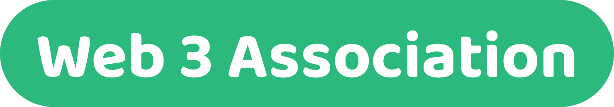

# 👋 About W3A

<figure><figcaption></figcaption></figure>

⭐ **Mission**

Fix the incentives through the evolution of treasuries.

🎯 [**Focus**](focus.md)

Our focus is to support existing teams across web 3 ecosystems with improving their treasury systems. We achieve this through the creation and continued improvement of knowledge resources that help provide insights and actionable information for teams to use when improving their own treasury systems. The Web 3 Association is looking to create the industry preferred destination to learn about Web 3 treasuries.

💡 [**Approach**](approach/)

Our core contribution outcome will be the creation of knowledge resources about treasury systems that provide insightful and actionable information for teams to use when improving their own treasury systems across web 3. A shared learning approach is being adopted that will focus on increasing the amount of collaboration and shared learnings for the benefit of all teams building solutions. Creating knowledge resources will mean identifying one focus area at a time, inviting collaborators to participate, conducting research and analysis and then making suggestions based upon those findings. Knowledge resources are the core focus and outcome from our contribution efforts. Over a longer time horizon there should also be opportunities for us to generate more impact for treasury systems by helping create open source software and supporting any standardisation efforts.

🗺️ [**Roadmap**](roadmap.md)

The initial focus is around foundational areas of the funding process such as how funding gets directed to different funding initiatives. This initial focus includes looking at what funding initiative types and proposal structures can exist, how proposals can be effectively assessed, how funding initiatives can be tracked and measured and then also how the impact of those funding initiatives can be reviewed.

:green\_heart: [**Sponsors**](sponsor-a-contributor/)

The Web 3 Association will be looking for founding sponsors to help fund our initial year of contribution efforts to support and improve treasury systems across web 3 ecosystems.

💬 [**Links & contact us**](links-and-contact-us.md)

All of the online profiles for Web 3 Association and some contact information
