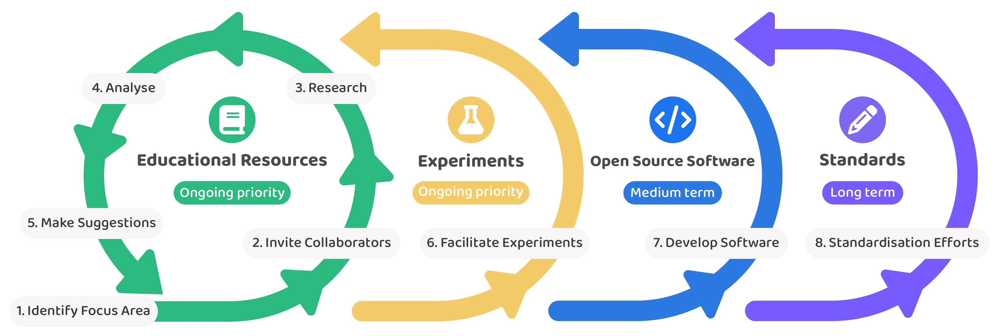

# 🏃‍♂️ Contribution process

The following contribution process outlines the main steps involved for creating the contribution outcomes of educational resources, experiments, open source software and standards. Each step in this process can be started and repeatedly revisited over time as more data and insights emerge. For this contribution process to be truly effective it will also need to have the [right environment](creating-the-right-environment.md) such as one that helps to increase impact alignment, collaboration and participation diversity.&#x20;

<figure><figcaption></figcaption></figure>

## **Educational resources (Ongoing priority)**

The usefulness of any insights generated by the educational resources created will have a large influence on how much impact the Web3 Association is able to generate when supporting and improving treasury systems. Any educational resources that we create will be revisited on an ongoing basis as new insights, data and feedback emerge. Educational resources are an important contribution for making insightful and actionable information about improving treasury systems. The long term goal will be to create the industry preferred location for resources regarding treasury systems.

**1. Identify focus area**

Initial contribution outcomes made towards supporting and improving treasury systems will be achieved by selecting one focus area at a time and then starting the iterative process of inviting collaboration, conducting research and analysis and making suggestions. Contributors supporting this shared learning approach will collaborate with teams building treasury systems to identify which areas are the most important to work on in the short term. Some example areas could be defining the types of funding initiatives that can exist with what data is needed for different proposals types, how they could be assessed prior to funding them and also how they can be tracked or measured once funded. Selecting smaller areas of focus will help with speeding up the process of going through the iterative loop of creating educational resources, getting feedback and then repeating the process to keep improving those resources.

**2. Invite collaborators**

Once a small area of contribution is selected the next step will be to invite collaborators from any teams building treasury solutions. These collaborators could come from existing business and organisations as well as emerging Web3 ecosystems. Invitations for collaboration will include a request for feedback on what areas they believe should be prioritised in the short term and then also some information regarding how these contribution outcomes could benefit their own treasury systems ongoing development. Existing projects will not need to collaborate with the contributors working on these specific areas of work for the contribution outcomes to be generated. Effort should be made to increase the amount of participation wherever possible to help with increasing the diversity of insights and opinion that can be incorporated into the educational resources.

**3. Research**

After any initial knowledge and insights is gathered from invited collaborators the next step will be to thoroughly research the existing market and collate any available research papers, reports, previous or current implementations and any usage or adoption data into a comprehensive resource. The goal is to find the most useful and insightful information rather than trying to cover every potential source of information. Research should try to cover what is actually happening across the industry or what has previously happened around different solution approaches that existed to solve certain problem areas. After an initial round of research is completed the resource can be shared for feedback to identify if any noteworthy information is missing.

**4. Analyse**

Analysis can be started once there is a sufficient amount of research around the contribution focus area. Analysis will help with identifying and exploring the problems that exist, where problems have been effectively solved and what solution approaches have been used, what similarities and differences exist between different implementations, the effectiveness of different implementations that exist or that previously existed, any overall trends on what remaining problems need to be solved and also about the usage and adoption of these solutions. This analysis would be shared to identify any factors that may be missing, what misinterpretations may exist or when any further information could be needed to improve or contradict any findings.

**5. Make suggestions**

Once the focus area is better understood through research and analysis the next step will be to make any initial suggestions on how relevant problems could be solved using existing or improved solution approaches. Suggested solutions could range from being data structures, processes, specifications to formulas or anything else that helps any teams building their treasury solution. Another aspect of these suggestions should be to help identify areas worth exploration due to a lack of experimentation in certain areas. These situations could create opportunities for identifying better approaches to the currently adopted ones. The end goal of this step in the process is to help foster experimentation wherever needed to better solve any of the problems identified and also to suggest good solutions to a problem when they do exist. Collaboration with existing communities will be a vital part for turning these suggestions into experiments when they are new suggestions. When they are suggestions towards effective solutions then any adoption of those suggestions should yield even further insights that either support or reject the suggestion. Multiple iteration loops of continued research, analysis and more suggestions can be expected before the more effective solutions are identified with any level of confidence. This process will help with creating useful insights on the potential tradeoffs of certain process or technical design decisions and where further improvements could be potentially made in the future.

## Experiments (Ongoing priority)

Research and analysis about treasury systems will help with identifying the more promising approaches that are worth experimenting with across Web3 ecosystems. After these potential experiments have been identified further efforts can be made to design and execute experiments that can determine how effective these approaches are for Web3 ecosystem treasuries.

**6. Facilitate experiments**

Contribution efforts can help with the creation and operation of any treasury experiments that happen across the industry. Proposals, onboarding, support, contribution verification, moderation and sentiment & feedback gathering are some of the areas that the Web3 Association could help with. Regardless of whether the Web3 Association helps with an experiment or not one key area of focus will be the analysis of any experiment outcomes so that any learnings can be documented and shared with the wider industry.

## **Open source software (Medium term)**

As more educational resources are created and trends begin to emerge we might identify opportunities to develop open source software that will benefit a wide range of teams building treasury systems. It could be years until more effective solutions are established which would create the opportunity to create an open source reference implementation of that solution. The key consideration to make will be from looking at what existing open source software already exists in different ecosystems and then determining how widespread the impact would actually be for those ecosystems if certain open source software were to be developed.

**7. Develop software**

Once more effective and widely adopted solutions emerge and a higher level of confidence is achieved that they are in fact effective there is a benefit in considering whether developing open source software could be valuable for the range of different ecosystems and teams who are building treasury solutions. Open source reference implementations of effective solutions could be created that can operate on different Web3 ecosystem blockchains and applications. These reference implementations could then be adapted, used and integrated into any existing projects to benefit their own treasury management or solution development. Making it easy to adopt the most effective solutions to different treasury problem areas would help increase the speed in which teams can built out their own solution and also help provide even more real world usage on a given approach. Openly available tooling and solution software can help increase the iteration speed of teams building solutions and give them more time to focus on the other main problem areas that still exist in their treasury system.

## **Standards (Long term)**

Establishing standards has a myriad of benefits for improving the efficiency, robustness and scalability of different protocols and applications. An opportunity to support standardisation efforts can emerge if solutions begin converging increasingly towards a similar approach to solve certain treasury problems. Some areas will be more difficult to standardise than others however supporting any efforts when this is the case will be an effective way to further support and improve existing and emerging treasury systems across different ecosystems.&#x20;

**8. Support standardisation**

Effective solutions to each problem relevant to treasury systems should emerge over time. Solutions which are increasingly well tested through real world usage will have increasing evidence of their effectiveness. In these situations effort can then be directed towards identifying whether this solution or groups of similar solutions could be potentially standardised. Collaboration can be encouraged from many participants on what data structures, terminology, technical specifications, documentation and further details would be needed to help an existing solution into a technically documented and openly available standard. There can be many ways to solve different treasury problems, each of which can have different levels of complexity on how to solve them. Different levels of experimentation, iteration and adoption might be needed to effectively address and understand whether a solution is truly effective. Due to this any efforts towards supporting standardisation should be seen as a longer term goal so that treasury systems can further mature and become more widely adopted.
