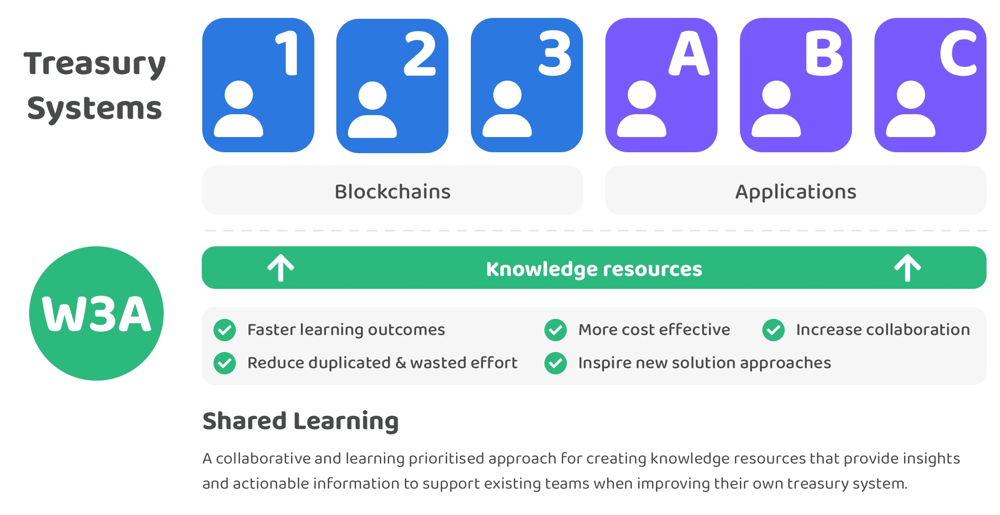

# 🎓 Shared learning

How can we increase the rate in which treasury systems are improved across Web3 ecosystems so that they create increasingly impactful outcomes that support and grow their ecosystems more effectively? What complementary approaches could be integrated into an existing team's development process to help them iterate and improve their own solutions more quickly?

Shared learning across the industry can help with answering these questions and potentially provide an effective path to increasing the adoption of Web3 technology through the adoption of an efficient and effective approach to improve treasury systems.

## Current problems

**Time consuming to keep up to date with industry progress**

There are many Web3 ecosystems that each have a treasury to manage and disburse. Projects within these ecosystems also usually require their own solutions for managing and disbursing treasury assets. The vast number of ecosystems and projects that are building treasury systems in parallel makes it increasingly difficult for these teams to have enough time to find out what is happening across the industry. Not having easy access to the progress being made in surrounding ecosystems can make it easier to miss insightful learnings and ideas about how to better approach solving important treasury problems.

**Difficulty in determining which solutions are working most effectively**

Existing treasury solution builders will often have a limited amount of time to look at other treasury solutions across the industry due to the level of effort it would require to understand and properly analyse these alternative systems and approaches whilst also trying to build their own solutions. A meaningful amount of time is often needed to properly analyse the available data and determine the current impact that those treasuries are currently generating to more confidently identify which approaches might be actually effective or not.

**Lost learnings from failed or pivoted projects**

Treasury systems are complex and require ongoing iteration and improvement. Ideas can often be trialled and then discarded once the outcomes do not produce the desired result. As each ecosystem executes these experiments in parallel it will be easy for those learnings to get lost by not being documented. A lack of available learnings on what approaches haven’t worked for other ecosystems can lead to situations where different ecosystems end up adopting a similar and ineffective approach due to the lack of available evidence that covers the issues these certain approaches may have.\

**Isolated learning & duplicated efforts**

Without any collaborative and supportive structures in place most treasury teams could end up learning in isolation on how to improve and iterate on their own solutions. A lack of external collaboration decreases the amount of skill and thought diversity that could have helped with more identifying effective solutions for solving different treasury problems. There is not a large incentive for competing ecosystems to collaborate and support other ecosystems. Less collaboration across the industry results in a reduced flow of information and insights between the teams working on similar treasury problems. Development of treasury systems in isolation due to less collaboration can result in efforts being more easily duplicated across multiple ecosystems concerning research, analysis, development and experimentation of new approaches.

## **Shared learning**

<figure><figcaption></figcaption></figure>

A focus on shared learning means increasing the amount of available knowledge resources available for teams to use when improving and iterating on their own treasury systems. The goal of shared learning is to help maximise collaboration and any learnings made across the industry. This helps increase the rate in which existing treasury systems can be improved and more widely adopted. Knowledge resources will focus on providing insights and actionable information for each ecosystem so they can more quickly identify ways to improve their treasury system in being able to manage and distribute community assets. Focussing on collaboration and shared learning creates an opportunity to help the wider industry achieve their goals at a faster rate. Our goal is for our knowledge resources to eventually become the industry preferred location to learn about treasury systems.

A group of contributors focussed on shared learning creates the opportunity for a supportive structure for helping existing teams building treasury solutions. Contributors would directly collaborate with and help existing teams through research, analysis and suggestions that focus on improving the knowledge available about treasury systems. The main [contribution outcomes ](contribution-outcomes/)of an approach focussing on shared learning is the creation of knowledge resources for the benefit of ecosystems building treasury solutions. Over the longer term there is also an opportunity to help with the development of open source software and supporting standardisation efforts.

**Advantages**

* **Faster learning outcomes** - Bringing together research, analysis and data about the range of treasury systems across the industry will help with identifying the different approaches that exist for solving important treasury problems. These efforts can help to speed up the identification of which approaches are working effectively or not which can help the wider industry in improving their own treasury systems at a faster rate. Creating impactful resources means that teams building treasury solutions will be able to better identify which approaches to avoid, which to explore further and which ones to adopt when improving their own solutions.
* **More cost effective** - Insightful and actionable information about treasury systems is beneficial for many blockchains and applications across Web3 ecosystems. A shared learning approach can become highly cost effective for these ecosystems as the cost of the contribution efforts can be split between each of the participating ecosystems. The full outcome of any resources created are available for the benefit of the entire industry. The more that the costs for these types of contributions can be shared across many ecosystems the more cost efficient the industry becomes in improving treasury systems. Reducing these costs also means that each ecosystem is then able to direct more funding to other impactful initiatives rather than doing repeated and similar work by themselves in isolation.
* **Reduce duplicated & wasted effort** - Each existing team in the industry won’t need to spend the same amount of time doing deep research and analysis if they can support an approach that effectively creates those outcomes for them. Resources that increase the amount of knowledge available about treasury systems will help existing teams building treasury solutions be able to spend time on unsolved problems and avoid common pitfalls and mistakes. Removing the need for teams to conduct as much research and analysis themselves will help to reduce the duplicated and wasted effort that could happen across the industry.
* **Inspire new solution approaches** - Resources that cover a wide range of potential ways that a treasury system could be approached can help with inspiring existing teams with finding new and novel ways to approach solving important treasury problems. More experimentation is greatly beneficial to the wider industry as any outcomes can be recorded and shared across different ecosystems when iterating on their own treasury system.
* **Increase collaboration** - Contributors that help with creating treasury knowledge resources for the wider industry would not be competing with any existing teams building solutions. Ecosystems that financially support shared learning efforts can help to align the incentives for increasing the amount of collaboration between as many teams as possible by enabling contributors to help with creating high quality resources that can generate ongoing impact for those ecosystems. The higher the participation becomes for this shared learning approach the faster that teams across the industry can iterate and improve their own solutions. Increasing the diversity of skills, backgrounds, values and cultures involved in the creation of these knowledge resources can help with generating higher quality and more informed outcomes. Feedback from existing teams will also help to provide an effective path for iterating and improving these resources and increasing their overall impact over time.

**Potential issues**

* **Collaboration time cost** - Existing communities and projects may not have much time to give and receive feedback on different problem areas they are working on. This could make it difficult to create knowledge resources with the same detail of information. Although this could be an issue it is not a blocker for making quality knowledge resources. Most data about the outcomes of many treasury systems is publicly available meaning it wouldn't prevent any contributors from being able to identify the approaches being used and what relevant insights and data points exist that can help identify effective solution approaches.

## **Summary**

**Complementary and supportive approach**

Contributors focussed on shared learning will be able to provide a complimentary and supportive structure to improve the knowledge and resources available around the focus area of treasury systems. Knowledge resources can be used across all Web3 ecosystems to help with improving their own treasury system. Incentivising shared learning at a foundational level can help better support existing teams who are building and learning about how to improve their own treasury system rather than working in isolation. A small capital allocation from different Web3 ecosystems towards increasing the amount of shared learning and knowledge available presents a large opportunity to increase the speed that Web3 ecosystems can collectively identify and adopt the more effective solutions. Quality knowledge, learnings and open source software that is readily available for usage and integration by existing project teams can help them to iterate more quickly and save time by reducing duplicated and wasted efforts.

**Effectively incentivised collaboration**

Contributors working under a shared learning approach are highly incentivised to collaborate with as many existing teams as possible to provide value and share learnings across Web3 ecosystems. Contributors supporting efforts to increase the knowledge around a given problem area are not competing with existing teams making treasury systems. Existing projects that benefit from more knowledge resources are more incentivised to support and collaborate with that ongoing work and provide feedback or request areas of improvement to further benefit the evolution of their own treasury system.

**Scalable knowledge and support structure**

Many problems faced by different Web3 ecosystems are shared across every ecosystem. An increasingly comprehensive knowledge base helps provide an economically efficient and scalable structure to support existing teams building treasury systems across multiple Web3 ecosystems. Efficiently identifying and sharing learnings and knowledge across different ecosystems means more funding can be saved and directed towards other important problems and experiments in each of those communities.

**Supportive structure for open source software and standardisation**

A shared learning approach provides a simple process driven way to increase the amount of knowledge available through ongoing research and analysis about treasury systems. As these resources mature there is an opportunity to create further impact for the industry by identifying areas where open source software could be produced and widely adopted due to identifying an effective approach that is being increasingly adopted. If ecosystems begin to converge on similar approaches to solve a certain treasury problem then the opportunity also emerges to consider how those solutions could be standardised.
