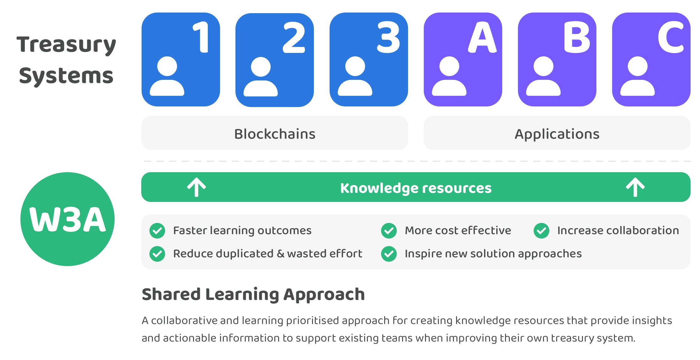

# 🎓 Shared Learning Approach

How could the rate in which treasury systems are improved across web 3 ecosystems be increased so that the industry can become more effective at creating treasury solutions that effectively support and grow their ecosystems. What work flow changes or different approaches could be adopted and integrated into existing teams development process to help them iterate and improve their own solutions?

The following outlines some of the problems that exist for teams building treasury solutions and how a shared learning approach could be an effective way to help with creating more effective treasury systems.

### Current problems

**Time consuming to keep up to date with industry progress**

There are numerous different web 3 ecosystems with treasury systems that also often have a number of applications building on top that also require effective ways to manage and distribute a community treasury. The vast number of projects building in parallel makes it increasingly difficult for existing teams to find enough time to find out what is happening across the industry. Not seeing the outcomes of the different developments happening in different treasury systems makes it easier to miss insightful learnings or ideas on how to better approach solving different problems.

**Difficulty in determining which solutions are working most effectively**

Existing treasury solution builders often have limited capacity to spend time looking at other treasury solutions due to the level of effort required to understand any analyse these alternative approaches whilst also trying to build their own solution. Sufficient analysis is needed covering the data and impact generated from these different approaches to treasury solutions to more confidently identify which approaches are truly effective or not.

**Lost learnings from failed or pivoted projects**

Treasury systems are complex and require ongoing iteration and improvement. Ideas are often trialled then discarded once the outcomes do not produce sufficient impact. As each ecosystem does these experiments in parallel it will be easy for those learnings to not to be documented and be widely shared. A lack of available learnings on what approaches haven’t worked for other treasuries can easily result in multiple ecosystems taking a similar ineffective approach due to a lack of available insights on the issues that certain approaches may have.

**Isolated learning & duplicated efforts**

Without any external supportive structures and collaborators in place most treasury teams could be learning about how to improve and iterate on their own solution in isolation. A lack of external collaborators decreases the amount of thought diversity and skills sets available that could help with more effectively identifying good solutions to different treasury problem areas. There is no direct incentive for competing ecosystems to collaborate with other projects. Reduced collaboration results in less flow of information and insights between these ecosystems. This lack of collaboration comes at the detriment to all these ecosystems if it means reducing the speed in which each ecosystems can gain useful insights to make well informed decisions on how to improve their own treasury systems. Efforts around research, analysis and learnings could be completely duplicated across ecosystems if each team working on their own treasury solution is doing so in isolation.

### **Shared learning approach**

<figure><figcaption></figcaption></figure>

A shared learning approach focuses on increasing the amount of available knowledge and resources available for teams to use whilst they improving and iterate on their own solutions. The goal of a shared learning approach is to help maximise collaboration and shared learnings across a given industry. This helps to increase the rate in which existing processes, protocols and applications are improved and subsequently become widely adopted. In the context of treasury systems, the focus is placed on helping each ecosystems find ways to most effectively distribute and manage their treasuries for the benefit of their ecosystem. Focussing on collaboration and shared learnings creates an opportunity to help the wider industry achieve these goals at a faster rate. In the short term a shared learning approach would focus predominantly on researching, analysing and understanding different problem areas so that effective suggestions and learnings can be identified for each problem. As the research and analysis is improved over time the ultimate goal for these resources created is for them to become the go to knowledge based resource about treasury systems that benefits all web 3 ecosystems.

A shared learning approach is a supportive structure for helping existing teams building treasury solutions. Contributors would directly help existing teams through the research and analysis they generate that would aim to improve the education and knowledge around different treasury focus areas.

**Main contribution outcomes**

* Short term - Research and analysis that helps to support existing solution builders with improving their ecosystems treasury system. Over time the iteration and improvement of this research and analysis would have the goal of becoming the go to resource for treasury systems.
* Medium term - Open source reference implementations of the most effective solutions to common treasury problems for the benefit of new and existing teams building treasury solutions.
* Long term - Support efforts to try and standardise solution approaches which are becoming widely adopted and that also have sufficient supporting evidence of its effectiveness.

**Advantages**

* Quicker learning outcomes - Focussing on specific problem areas and bringing together research, analysis and case studies to create knowledge based resources can help increase the speed in which key learnings are identified and shared across different ecosystems. Searching for feedback and suggestions for iteration of this knowledge resource can further help further tighten the iterative learning loop by integrating further insights and data that improve currently established learnings. The faster these learning outcomes can be achieved and shared the higher the opportunity there is for solutions teams to iterate faster in adopting effective solutions and the easier it will be to identify where common solutions are emerging which could then be turned into open source reference implementations and even potentially standardised.
* Case studies of different solution approaches - Ongoing research towards what is happening across different treasury systems across the industry will help with identifying new and novel approaches to solving different problems. Keeping a log of these solutions and how they perform over time will help the creation of case studies that can be used as a useful resource for existing teams to determine what has been effective and how they can integrate the learnings from those solution approaches into their own treasury systems improvement.
* Shared learnings & knowledge - Any learnings which highlight what effective solutions exist for solving certain problem areas can be shared across any of the teams building solutions across different blockchains, protocols and applications. Contributors focussed on improving the available learnings and knowledge have a direct incentive to collaborate with any existing projects to help aggregate existing learnings and resources into a comprehensive knowledge based resource to better help existing project teams. The more that quality learnings, knowledge and resources can be shared across the wider web 3 ecosystems the quicker that each project teams will be able to learn and iterate on their own solutions as well as avoid any common pitfalls.
* Higher skill diversity - Existing project teams can benefit from a group of contributors incentivised to collaborate with existing projects by giving them access to a more diverse range of skill sets that those contributors may have. Contributors focussed on increasing the amount of shared learnings, knowledge and resources available are able to provide their expertise and skills to any of the teams building solutions and potentially help fill in gaps of knowledge or skill that may exist to better support these teams in their own solutions iterative improvement.
* Highly collaborative - Contributors focussed on a shared learning approach would not be competing with existing teams building solutions. Contributors would be directly incentivised to collaborate and share learnings, skills and knowledge with any projects working in that area of focus. Time can be allocated to provide support and useful information to these projects whenever it is highly beneficial for those teams. Projects implementing solutions benefit from being able to utilise any of the learnings and resources in anyway beneficial to their own efforts. Resources could save existing projects meaningful time and effort from doing everything themselves and would have contributors that support any of their efforts to do so in a collaborative manner. Feedback from projects building solutions would help with guiding future efforts in identifying impactful areas where further learnings could be established.
* Reduce wasted and duplicated effort - Contributors that increase the shared knowledge across ecosystems provides an opportunity to prevent existing teams from spending time researching, analysing and developing software that may have already been created when it has already been made freely available for them to use. The more this is achieved the more that each existing team can spend time on other problems. This tightens the loop of the time taken to improve their own solutions. Increasing efficiencies in the improvement of existing solutions also increases the return on investment for the ecosystems making contributions to a shared learning approach which is more efficient than creating all the knowledge and resources themselves.

**Potential issues**

* Collaboration time cost - Existing communities and projects may not have much time to give and receive feedback on different problem areas they are working on. This could make it difficult to generate impactful shared learnings for some of these solutions if contributors focussed on improving the available knowledge are unable to gather enough information. This is not a blocker that prevents contributors being able to identify approaches, insights and data points that point to effective solutions however it could slow down the learning process.

### **Summary**

**Complimentary and supportive approach**

A shared learning approach offers a complimentary and supportive structure to improve the knowledge and resources available around our focus area of treasury systems. Knowledge and resources that can then be used across all web 3 ecosystems. Incentivising shared learning at a foundational level can help support any existing team who is building and learning about how to improve their own treasury rather than working in isolation. A small capital allocation from different web 3 ecosystems towards increasing the amount of shared learning and knowledge available presents a large opportunity to increase the speed that web 3 ecosystems can collectively identify and adopt the more effective solutions to solve important problems. Quality knowledge, learnings and open source software that is readily available for usage and integration by existing project teams can help them to iterate more quickly and save time by reducing the amount of wasted or duplicated effort.

**Effectively incentivised collaboration**

Contributors working under a shared learning approach are highly incentivised to collaborate with as many existing teams as possible to provide value and share learnings across the wider web 3 ecosystems. Contributors supporting efforts to increase the knowledge around a given problem area are not competing with existing projects making solutions. Existing projects that benefit from those efforts and knowledge are then more incentivised to support and collaborate with that ongoing work and provide feedback or request areas of improvement to further benefit the evolution of their own solutions.

**Scalable knowledge and support structure**

Many problems faced by different web 3 ecosystems are shared across each ecosystem. An increasingly comprehensive knowledge base with open source resources helps to provide a economically efficient and scalable structure to support many existing teams from different web 3 communities. The more efficiently that learnings and knowledge can be identified, established and shared across different ecosystems the more funding can be saved and then directed towards other experiments and important problem areas in each different community.

**Supports the goal of establishing standards as a long term north star**

A shared learning approach provides another process driven way to increase the amount of open source knowledge and software needed to create more effective solutions. Solutions which in the future could eventually become standards if they become more widely adopted. A shared learning approach is a complimentary way to support existing teams to solve important problems in web 3 ecosystems. Increasing the amount of shared knowledge and resources provides an opportunity to increase the rate ecosystems can collectively identify effective solutions to different problems and when those solutions become good candidates for standardisation.
