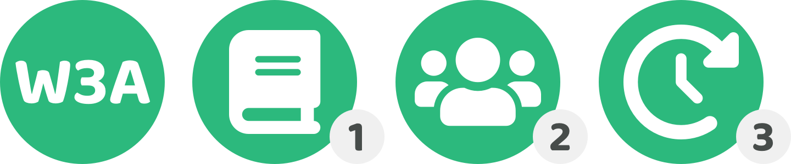

# ✍ Current roadmap plan

<figure><figcaption></figcaption></figure>

The Web3 Association has already started looking at how different ecosystems could approach disbursement by identifying different disbursement approaches that exist and what the different factors and potential trade offs are for these approaches.

We’re looking to expand and iterate on our existing work and dive deeper into these topic areas to improve the available disbursement resources. These resources can then become more useful and insightful for Web3 ecosystems across the industry and help with providing suggestions on what approaches could be worth further exploration and experimentation.

Upon finishing this analysis we are looking to introduce community based incentives to help bring together contributors from across the industry from different ecosystems to discuss and suggest more approaches that might be missing or to help with making any refinements and improvements to any of the existing resources.

The outcomes from both these initiatives will help with identifying some of the most promising disbursement approaches that ecosystems across the industry could experiment with or adopt in their own treasury processes.

<figure><figcaption></figcaption></figure>

A number of educational resources have already been created around the different disbursement approaches that teams building treasuries could consider. We’re looking to further explore and deep dive into this area to perfect these resources and expand on this work.

**Existing resources**

* [docs.treasuries.co](https://www.notion.so/Disbursement-Approaches-Incentive-Design-bd8adbd2e3af4bf5ad0056278f1a0575?pvs=21)
* [disbursement.treasuries.co](https://www.notion.so/Disbursement-Approaches-Incentive-Design-bd8adbd2e3af4bf5ad0056278f1a0575?pvs=21)
* [suggestions.treasuries.co](https://www.notion.so/Disbursement-Approaches-Incentive-Design-bd8adbd2e3af4bf5ad0056278f1a0575?pvs=21)

**Areas of focus**

* Open source contributors industry suggestion - Based on the completed disbursement analysis there is an industry wide opportunity to experiment with a contributor focused disbursement process that could be simple and effective for Web3 ecosystems. A proposal will help to highlight this opportunity and how we could support this experiment.
* Self sovereign identity opportunities - Digital identities are an emerging technology that have a large potential to give individuals more ownership and control over their personal and digital information. A number of opportunities can be explored for how this technology could be integrated and used in a Web3 ecosystems disbursement process.
* Incentive attachment analysis - Exploring the implications and differences that occur when the incentive get attached to different areas within Web3 ecosystems and how that could impact the behaviours and outcomes of the ecosystem. For instance how do the incentives impact an ecosystem when they are attached to the infrastructure, protocol or application layers? How do these differences align or misalign the incentives? What conflicts could occur?

These pieces of analysis and any suggestions will be shared across different communities to receive feedback where community incentives will also be used to help with promoting suggested improvements to the resources created.

<figure><figcaption></figcaption></figure>

After the resources are created and improve about different disbursement approaches and suitable incentive design mechanisms we can then look at introducing and promoting community incentives to help encourage people from across the industry to provide their expertise and feedback. These initiatives will help with identifying areas of improvement or completely new suggestions to the existing resources. This feedback will help to improve the overall quality of the resources. As part of these initiatives we will spend time exploring what existing ecosystems are looking to accomplish with their own approaches and then help with providing our own thoughts and feedback as well as incentivising the community to share their own viewpoints to those ecosystems.

**Areas of focus**

* Exploration of new ideas and approaches - The resources should help with identifying the breadth of different approaches that could be adopted. An important part of achieving this will be incentivising community members to further explore and identify any areas that haven’t already been covered or thought about.
* Analysis improvements - The existing resources will nearly always have potential areas of improvement that can make them more useful, concise or insightful. Community members will be compensated for providing feedback that leads to these improvements.
* Research improvements - Research by community members could potentially reveal important trends or insights that are currently not covered and lacking in the existing resources. The community incentives can compensate for the identification of research that is relevant and insightful to the wider industry that can then be added to the resources for reference.
* Community feedback - Capturing the communities current sentiments and thoughts about any of the suggestions or analysis made in any of the resources will help with determining what disbursement approaches or incentive design mechanisms the community is currently most interested in exploring or using across different ecosystems. This could provide useful information for ecosystems to consider when making their own decisions on where to spend more effort in improving their own treasury systems and processes.
* Ecosystems intentions & feedback - As the resources mature and become more well rounded it will be useful to capture the intentions and thoughts of the teams who are building the treasury systems and processes in each ecosystem. This information will make it clearer what hypothesis each ecosystem currently has in what disbursement approaches and incentive design mechanisms could be the most effective and then allow for the communities in those ecosystems to provide their thoughts and feedback and participate in those discussions.

Each of these areas of focus will need to be handled with a best efforts approach due to the fact there will be no guarantee that community members come forward to contribute to any of these areas. We will need to react and respond to what actually happens rather than assume the outreach and incentives we initiate will generate the expected participation and desired result. Community incentives may be updated so they become more effective at generating the right outcomes, however at no point will the community incentives be redirected to any core W3A contributors.

**Relevance & potential impact for the industry**

Each ecosystem in the industry is already spending resources on improving and maintaining their own treasury systems and processes to disburse treasury assets. By incentivising the wider industry to participate in discussions and contribution efforts towards improving treasury systems there is an opportunity to share the cost of identifying effective and scalable solutions that can help solve important treasury problems. Our intentions with the community incentives is to create a growing collaborative force across the industry that can help with improving Web3 treasury systems. This could help the entire industry improve and grow at a faster rate than it is currently. The more the industry can collaborate the faster that shared learnings can be achieved which can help with speeding up the improvement and ongoing evolution of different treasury systems and processes.

<figure><figcaption></figcaption></figure>

After creating further resources, making improvements and bringing together community feedback our next task will be deciding where to allocate our contribution efforts moving forward. The feedback and response to the work mentioned above will help to guide us in determining where we believe we can create the most impact for the industry. We will also ask ecosystems to provide their feedback on where they believe our efforts could be best allocated.

**Example future areas of focus**

* Impact measurement - An important area of potential improvement in the industry is how impact is measured from completed initiatives. Improvements in measuring impact can be an effective way for better identifying which disbursement approaches are performing more effectively and how incentives can be better aligned with generating more impactful outcomes in the future.
* Gather industry data - If many ecosystems are experimenting with different disbursement approaches and incentive mechanisms there may be merit in documenting the data that emerges from these processes and helping to make that more digestible and comparable. This data could make it easier to identify what is working well and what opportunities exist for improvement.
* Prioritisation systems - One area we have already as an important part of treasury disbursement is how communities prioritise certain initiatives over others. Our efforts in the future could be directed towards initial technical architecture and design efforts to explore how prioritisation systems could be developed to help communities in different ecosystems most effectively express what opportunities or problems they believe are most important for the ecosystem at that moment.
* Knowledge systems - We’ve already started to cover how knowledge is a vital part of treasury disbursement and that it impacts every other part of the process in prioritising impactful initiatives, identifying the most promising ideas and selecting suitable contributors to execute those ideas. Thinking about and designing potential knowledge systems that makes this easier for ecosystems to gather, digest and apply data could be an impactful area of work we could explore.

The above are just examples of potential areas of focus, however there are numerous other areas that could be relevant that could be pursued in the future. We'll discover more about how we can generate the most impact for as many ecosystems as possible as we continue to execute and collaborate with different ecosystems.
