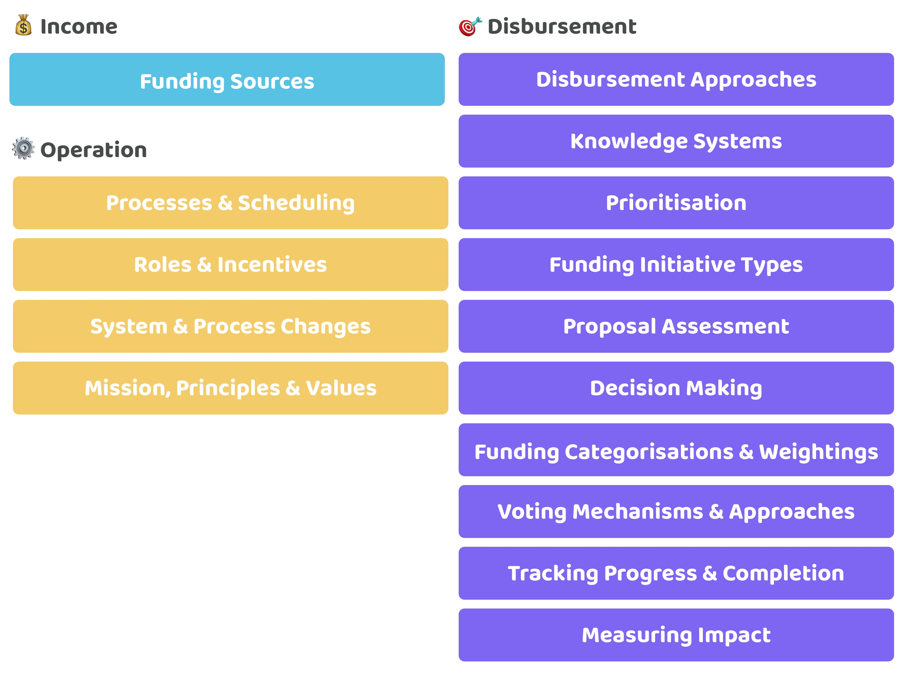

# 📗 Other areas of focus

The following are some example areas of focus that can be researched and analysed to discover areas of improvement across the different existing solutions in web 3 ecosystems. This list is not exhaustive and will be updated over time to include more areas for consideration and further contribution.

<figure><figcaption></figcaption></figure>

💰 **Income**

Exploring the ways an ecosystems treasury could become sustainable over the long term through different sources of income that can then be used to help address ecosystem priorities and support an ecosystems operation.

* **Funding Sources** - Exploring what different income streams could help grow a communities treasury such as protocol taxation, services or donations. What kind of funding sources exist and which ones are currently working the most effectively?

⚙️ **Operation**

Finding out how a treasury can be operated effectively so that an ecosystem can more easily achieve its longer term mission and goals.

* **Processes & Scheduling** - The disbursement process and timeline for funding any initiatives will impact what amount of involvement is needed by different actors at each stage of the process. Things to consider include whether the funding is distributed in rounds or is it a continuous process? Should the different stages of funding disbursement use a mix of round based voting and a continuous voting process?
* **Roles & Incentives** - The management of treasuries and any funding disbursement process can include a range of roles to help ensure funds are responsibly and effectively managed and disbursed. The incentives and responsibilities that get applied to each of these roles will impact how well they are performed over a longer period of time and also influence how each participating actor could actually behave. Over a longer time horizon effort could be directed towards exploring where certain areas could be automated and where other areas benefit from more human involvement.
* **System & Process Changes** - Treasury systems need to be able to change and adapt with improvements and parameter changes to keep up to date and keep functioning effectively. Common treasury systems parameters will need to be well defined so community members understand their implications and how potential changes could impact the management of the treasury and any funding processes. What thresholds and mechanisms are needed to enact any changes will also need to be considered.
* **Mission, Principles & Values** - The mission, principles and values of a community can be documented to better inform internal and external community members what an ecosystem is trying to achieve and what is most valued. Other forms of documentation such as policies and guidelines will also need to be considered.

🎯 **Disbursement**

Exploring how an ecosystem can create systems and processes that disburse treasury assets to help with generating impactful outcomes for the ecosystem.

* **Disbursement Approaches** - There are numerous ways in which funding could be disbursed to impactful initiatives. Comparing the tradeoffs between different approaches can help with identifying where the most promising areas are for further experimentation.
* **Incentive Design** - What incentives are created and how they are attached to the disbursement process will have a profound impact on the behaviours and outcomes that get generated by the systems and processes that are used for disbursement.
* **Knowledge Systems** - There is a vast amount of information that is relevant to making well informed decisions. Understanding what information could be useful to the disbursement process will help with making voters more well informed. The easier and quicker it is for voters to get access to quality information the easier it will be to scale a governance process that is looking to increase community participation.
* **Prioritisation** - Communities should be able to prioritise where they believe more effort and contribution should be directed towards. This influences how funding could be disbursed and what funding processes a community uses to help with addressing the most important priorities. Community priority setting can help with finding out what consensus exists around which problems and opportunities are the most important for the ecosystem. Prioritisation can also require sufficient debate and discussion around the different problems and opportunities that exist to help with making more well informed prioritisation decisions.
* **Funding Initiative Types** - Exploring what types of funding initiatives can exist, what they are useful for and what forms of information is required or beneficial for voting. Example proposal types could include ideas, tasks and contributors.
* **Proposal Assessment** - Once a good process is established for gathering information about a certain funding initiative type a follow on step will be to determine if those proposals are of sufficient quality or not and whether they have the potential to be impactful. An assessment process can help with addressing this by identifying the merits, opportunities and potential issues applicable to each proposal.
* **Decision Making** - A community could adopt a range of approaches for the decision making process when voting on which initiatives to fund. Considerations are needed on when it is useful to adopt a qualitative process to bring community members together to discuss different initiatives. Also considerations are needed for what data and insights could be integrated into the decision process to better inform the voters.
* **Funding Categorisations & Weightings** - How funding is made available will have an impact on what initiatives can be funded and the overall effectiveness of the funding process. Treasuries have the option to allocate resources to a range of initiative types and apply different amounts of funding to each type. Creating these categorisations is difficult as any outcomes from these decisions will determine how funding is directed to certain areas and groupings of initiatives.
* **Voting Mechanisms & Approaches** - What voting approaches could be used to select and vote on proposals in different funding initiatives? Understanding the tradeoffs of each voting approach will help with the creation of more effective voting systems that can handle the different uses cases and types of funding initiative. The weighting models that get applied to voting will also be a point of consideration, such as when skill or length of contribution time should increase or reduce someones voting power. Different forms of voting will need to be considered and their trade offs such as for a yes or no system, preference based voting, quadratic voting and other voting mechanisms.
* **Funding Distribution Mechanisms** - Funding could be distributed to selected proposals in a number of ways such as through milestones, time based segmentation, all at once or upon completion of the proposals intent. Different funding initiatives may be more suited to different release mechanisms and cadences for distributing funding based on the risks and complexities of the funding initiative type.
* **Tracking Progress & Completion** - A community can benefit from being able to measure and verify the progress and completion of any of the funded proposal. Distribution mechanisms used to distribute funding to contributors can also potentially include automated or community based review processes as part of the disbursement process to sign off milestones and completions. Improving this process can help with reducing the loss of treasury funding to time wasters, scams or underperforming proposals. It could also help with identifying the more effective contributors from looking at the execution of their own proposal.
* **Measuring Impact** - The community benefits from reviewing completed proposals to reflect on how impactful any generated outcomes were compared against the total amount of allocated resources it took to achieve those outcomes. Understanding the impact generated by each completed initiative will help with improving future funding disbursement decisions if voters are increasingly able to select initiatives that are more likely to create high impact.
